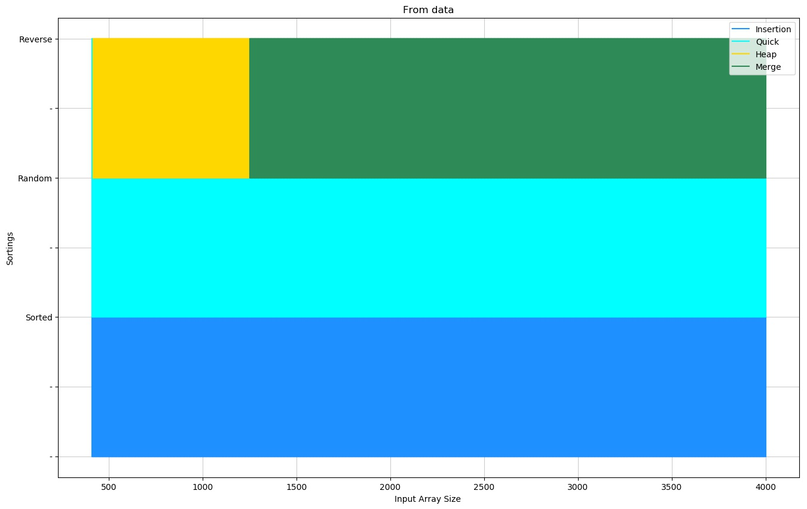

# GOAL
To analyze the time complexity of some sorting functions with real time data and by using tensorflow, predict
the time complexity of these functions in other scenarios.

# Methodology
The sorting functions considered here are : Bubble sort, Selection sort, Insertion sort, Merge sort, Quick sort and Heap sort.
These functions are coded in .
Configuration of the machine used in this project is :  
Processor : Intel(R) Core(TM) i5-8250U CPU @ 1.60GHz  
RAM : 8GB DDR4  
Operating System : Windows 10 64-bit

### 1. Generating Data
Functions for generating data is in . Here an array of a predetermined size is randomly generated and then 3 different cases are considered : already sorted data, randomly sorted data and reverse sorted data. For each size and for each case the same array is sorted using the aforementioned funcitons multiple times to get a more accurate representation of the time taken by the machine. Actually they were applied 100000/(length of array) times. The data is stored in file .
Here array size started from 10 to 1000 in steps of 10, and 1000 to 4000 in steps of 100.

Restriction : During experimentation the program crashed after quick sort was applied on sorted data for array size > 4000 due to recursion limit set by the machine. That is why the upper limit of array size for this project was set to 4000.

### 2. Training
The functions are in . Tensorflow was used in this regard. The method used was 2nd order polynomial regression. The thinking behind this selection is the time complexity of these sorting functions are at most O(n^2). That is why a 2nd order polynomial was used. The optimizer used here is the Gradient Descent Optimizer. A tensorflow model was created using this specification. The model has 1 input which will be the size of the array and 6 outputs representing the time taken in each sorting functions.  
This model was used for three different data cases : sorted_data, random_data and reversed_data.
As these three cases were independent, the training was done independently. Each model was trained using the generated data and for 2000 epochs each. The input data was scaled using the max array size as otherwise the optimization function would fail to optimize properly. 
The three models are saved in  ,  and  directories.

### 3. Data Collection from model
Using the models mentioned before, data was generated for array size 10 to 4000 and stored in . The functions are in . 

### 4. Analysis
Using the data generated and the data from training, different plots were created to get insight into the functions. This was done in .

# Sort Functions Analysis
### Individual function performance
  
From the plot, one can see that for both the three cases, this function has a 2nd order curve which is consistent as bubble sort has time complexity of O(n^2). The data generated from the model also seem to fit the training data. Also, even though all three cases are 2nd order, according to time taken : sorted_data < random_data < reverse_data.
  
  
Here also, all three cases bear a 2nd order curve. Selection sort also has time complexity of O(n^2) for all three cases and thus this is consistent. Here too sorted_data < random_data < reverse_data but the difference in their time is more negligible.
  
  
Here random_data and reverse_data have 2nd order curves while sorted_data seems linear. Insertion sort has time complexity of O(n) for sorted data and O(n^2) for all other cases. Thus this is consistent. Also, sorted_data < random_data < reverse_data is also observed.
  
  
Here all three cases show a curve which is not 2nd order and also not quite linear. This actually represents the time complexity of O(nlogn) of Merge Sort. Also sorted_data < reverse_data < random_data is observed even though the difference is quite negligible. Furthermore, the data used for training seems to fluctuate a lot which might have contributed to this representation.
  
  
Here sorted_data and reverse_data shows a 2nd order curve whereas random_data shows what appears to be linear characteristic, but this is because the other data is takes a much longer time resulting in a increases y axis limit. Thus this can be construed as O(nlogn) characteristic which is consistent with the time complexities of quick sort. The Worst Case for quick sort is O(n^2) and the best case is O(nlogn); worst case appears for sorted or reverse_sorted data. Also random_data < reverse_data < sorted_data is observed from the plot.
  
  
Like Merge sort, all three cases show a linear logarithmic characteristic. This is consistent with Heap sort's time complexity of O(nlogn) for all three cases. Like Merge sort, the data used for training seems to fluctuate a lot. Here random_data < reverse_data < sorted_data is observed even though the difference is quite negligible. But this might be because of the fluctuating training data.
 
 
 
### Individual Case Performance
<b>Training data for Sorted case</b>
  
 
<b>Model data for Sorted case</b>
  
From the plots one can assume that the model data produces an accurate depiction of the training data. Here, quick sort takes the longest time whereas insertion sort takes the least time.
 
 
<b>Training data for Random case</b>
  
 
<b>Model data for Random case</b>
  
Here too the model data seems to be close to the training data. Here, bubble sort takes the longest time whereas quick sort seems to take the least.
 
 
<b>Training data for Reverse case</b>
  
 
<b>Model data for Reverse case</b>
  
Here again the model data is close to the training data. Again, bubble sort takes the most time. Heap sort and Merge sort seems to take about the same time, though merge sort seems to win narrowly.
 
 
 
### Accuracy
Here accuracy was measured by comparing the sorting function which gave the least time from the models and actual data. The accuracy was 60% meaning the model was correct only 60 out of a 100 times. Upon inspection, this low accuracy was actually contained in the area where 10 <= array size <= 400. When the model was evaluated for 400 <= array size <= 4000, the accuracy rose to 87%. And in this scenario the inaccuracies were on the reverse_data case where heap sort and merge sort values were nearly identical.  
The low accuracy due to 10 <= array size <= 400 stems from the fact that here, polynomial regression was used on input data which was scaled to values between 0 to 1. That is why the values observed when input was very close to 0 actually gave negative output which is theoretically impossible, and that attributed to the low accuracy. Thus, the model is considered correct when input data is in the boundary 400 <= array size <= 4000.
### Recommended Sort Functions
  
The upper graph was generated from model data. This shows the recommended sorting algorithm for sorted random and reverse cases when input size varies from 400 to 4000. This model recommends to use insertion sort for any input size when the given data is already sorted. When the data is random, the model recommends to use quick sort for any input size.  When the data is reverse sorted, the model recommends to use heap sort when input size is < 1250. After that, the model recommends merge sort. 

# Conclusion
The file  contains functions to calculate accuracy. Also this file was designed for the purpose of giving individual input and observing the value calculated from the machine and the value from the model, to make comparisons easier. Also it has a "Recommendation" option which will give the user the sorting function the model and the user's machine recommends based on the input.  
As the data in this project is machine dependent, the same model won't work for hardware with different specifications. But the user can train the model himself through the given files.

### Future Plans
Use different Tensorflow models to calculate output, including classification algorithms and RNNs with different optimizers.
